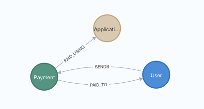

= Spring Data Neo4j application with Venmo payments data

This application uses the following resources:

* Data: https://github.com/JMHReif/graph-demo-datasets/tree/main/venmo-payments[Venmo data import^]
* Application (generated using https://start.spring.io/[start.spring.io^]:
** https://spring.io/projects/spring-boot[Spring Boot^]
** https://spring.io/projects/spring-data-neo4j[Spring Data Neo4j^]

== Data model

== Presentation

PDF version of the accompanying presentation is published to SpeakerDeck.

* https://speakerdeck.com/jmhreif/pouring-coffee-into-the-matrix-building-java-applications-on-neo4j[Pouring Coffee into the Matrix: Building Java Applications on Neo4j^]